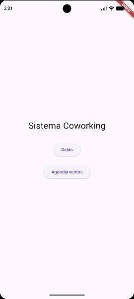
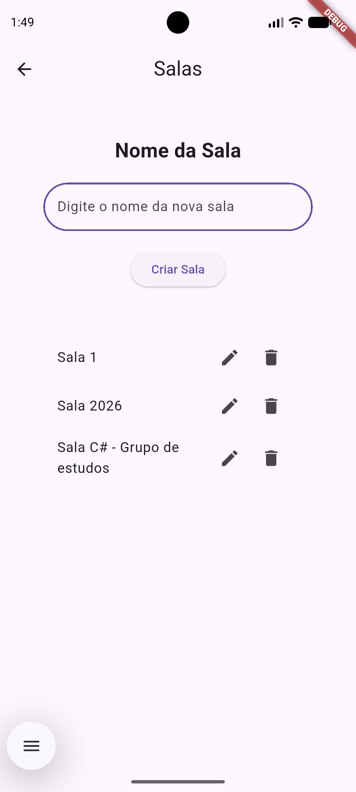
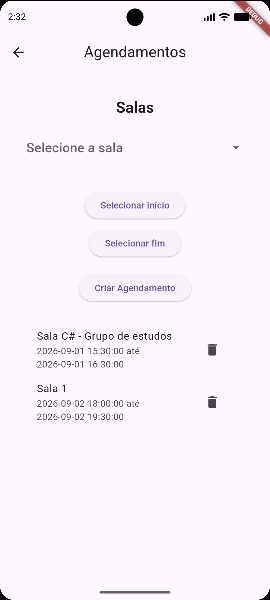

# Sistema de Agendamento de Salas — Coworking (Flutter)

Aplicativo mobile desenvolvido em **Flutter** com banco de dados **SQLite** para gerenciamento de salas e agendamentos de um espaço coworking.



---

## Sumário

* [Sobre o projeto](#sobre-o-projeto)
* [Telas](#telas)
* [Tecnologias](#tecnologias)
* [Quick Start](#quick-start)
* [Banco de dados](#banco-de-dados)
* [Estrutura do projeto](#estrutura-do-projeto)
* [Funcionalidades](#funcionalidades)
* [Regras de negócio](#regras-de-negócio)

---

## Sobre o projeto

Aplicativo mobile que permite o cadastro e gerenciamento de salas e agendamentos de um espaço coworking. O sistema garante que não haja sobreposição de agendamentos, registra todas as operações em log e impede a exclusão de salas com agendamentos futuros.

O projeto foi desenvolvido seguindo uma arquitetura em camadas (Models, Repositories, Screens), separando responsabilidades e evitando código espaguete.

**Status:** Concluído

---

## Telas

### Menu principal


### Gerenciamento de salas


### Agendamentos


---

## Tecnologias

- **Flutter** — framework para aplicações multiplataforma
- **Dart** — linguagem principal
- **SQLite** — banco de dados local
- **sqflite** — biblioteca de acesso ao SQLite no Flutter
- **path** — biblioteca para localizar o caminho do banco no dispositivo

---

## Quick Start

### Pré-requisitos

- [Flutter SDK](https://flutter.dev/docs/get-started/install)
- [Android Studio](https://developer.android.com/studio) (ou outro emulador configurado)
- [VS Code](https://code.visualstudio.com/) com a extensão Flutter (opcional)

### Passo a passo

**1. Clone o repositório**
```bash
git clone https://github.com/hithami/SistemaCoworkingFlutter.git
```

**2. Entre na pasta do projeto**
```bash
cd sistema_coworking_flutter
```

**3. Instale as dependências**
```bash
flutter pub get
```

**4. Rode o projeto**
```bash
flutter run
```

> O banco de dados SQLite é criado automaticamente no dispositivo/emulador na primeira execução do app, junto com todas as tabelas e triggers.

---

## Banco de dados

### Tabelas

| Tabela | Descrição |
|--------|-----------|
| `sala` | Cadastro de salas do coworking |
| `agendamento` | Agendamentos vinculados às salas |
| `log_operacao` | Log automático de todas as operações |

### Triggers

| Nome | Descrição |
|------|-----------|
| `log_sala_insert` / `log_sala_update` / `log_sala_delete` | Registram INSERT, UPDATE e DELETE da tabela `sala` no log |
| `log_agendamento_insert` / `log_agendamento_update` / `log_agendamento_delete` | Registram INSERT, UPDATE e DELETE da tabela `agendamento` no log |
| `bloqueio_deletar_sala` | Impede exclusão de sala com agendamento futuro |
| `bloqueio_sobreposicao_agendamento` | Impede sobreposição de agendamentos na mesma sala ao criar |
| `bloqueio_sobreposicao_agendamento_update` | Impede sobreposição de agendamentos na mesma sala ao editar |

O script completo de criação do banco está disponível em [`banco.sql`](banco.sql).

---

## Estrutura do projeto

```
sistema_coworking_flutter/
├── lib/
│   ├── core/
│   │   └── database/
│   │       ├── database_helper.dart
│   │       └── schema.dart
│   │
│   ├── models/
│   │   ├── agendamento.dart
│   │   └── sala.dart
│   │
│   ├── repositories/
│   │   ├── agendamento_repository.dart
│   │   └── sala_repository.dart
│   │
│   ├── screens/
│   │   ├── agendamento_screen.dart
│   │   ├── menu_screen.dart
│   │   └── sala_screen.dart
│   │
│   └── main.dart
│
├── docs/
│   ├── menu.png
│   ├── salas.png
│   └── agendamentos.png
│
├── coworking.db
└── README.md
```

---

## Funcionalidades

### Salas
- ✅ Cadastrar sala
- ✅ Listar salas
- ✅ Editar sala
- ✅ Excluir sala

### Agendamentos
- ✅ Criar agendamento vinculado a uma sala
- ✅ Listar agendamentos com nome da sala
- ✅ Excluir agendamento

---

## Regras de negócio

Todas as validações são executadas no banco de dados via triggers e constraints:

- ✅ Todos os campos são obrigatórios
- ✅ Nome da sala não pode se repetir
- ✅ Data/hora final deve ser maior que a inicial
- ✅ Não é permitida sobreposição de agendamentos para a mesma sala
- ✅ Não é permitida a exclusão de uma sala com agendamento futuro
- ✅ Todas as operações (INSERT, UPDATE, DELETE) são registradas automaticamente na tabela de log

---

Desenvolvido por [@hithami](https://github.com/hithami)
